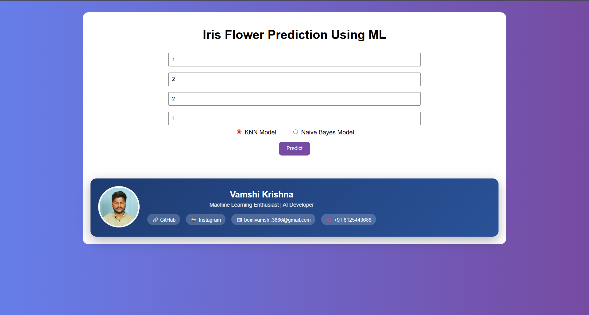
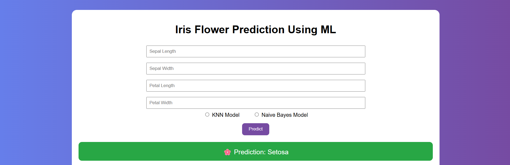

# IRIS-Prediction
<h1 align="center">🌸 Iris Flower Prediction System</h1>

Machine Learning Web Application using Flask  
Deployed on Render | Version Controlled with GitHub

<h2>📌 Project Overview</h2>

The Iris Flower Prediction System is a Machine Learning web application developed using Python and Flask.
It predicts the species of an Iris flower based on four input features:

<ul>
  <li>Sepal Length</li>
  <li>Sepal Width</li>
  <li>Petal Length</li>
  <li>Petal Width</li>
</ul>

Users can:

<ul>
  <li>Enter flower measurements</li>
  <li>Select a Machine Learning model</li>
  <li>Predict flower species</li>
  <li>View performance metrics (Accuracy, Confusion Matrix, Classification Report)</li>
</ul>

<h2>📊 Dataset Information</h2>

<ul>
  <li>Total Samples: 150</li>
  <li>Features: 4</li>
  <li>Classes: 3</li>
  <li>Balanced Dataset (50 samples per class)</li>
</ul>

<b>Target Classes:</b>
<ul>
  <li>Iris Setosa</li>
  <li>Iris Versicolor</li>
  <li>Iris Virginica</li>
</ul>

<h2>🛠 Technology Stack</h2>

<ul>
  <li><b>Programming Language:</b> Python 3</li>
  <li><b>Machine Learning:</b> Scikit-learn, Pandas, NumPy</li>
  <li><b>Web Framework:</b> Flask</li>
  <li><b>Frontend:</b> HTML, CSS, Jinja2</li>
  <li><b>Model Storage:</b> Pickle (.pkl)</li>
  <li><b>Deployment:</b> Render</li>
  <li><b>Version Control:</b> Git & GitHub</li>
</ul>

<h2>📂 Project Structure</h2>

<pre>
Iris-Flower-Prediction/
│
├── app.py
├── train.py
├── requirements.txt
├── Procfile
│
├── models/
│   ├── knn.pkl
│   └── NB.pkl
│
├── performance/
│   ├── performance_k.json
│   └── performance_n.json
│
├── templates/
│   └── index.html
│
├── static/
│   └── styles.css
│
└── README.md
</pre>

<h2>⚙️ Implementation Steps</h2>

<ol>
  <li>Load and preprocess dataset</li>
  <li>Split data into training and testing sets</li>
  <li>Train ML models (KNN, Naive Bayes)</li>
  <li>Evaluate models using accuracy and classification report</li>
  <li>Save models using Pickle</li>
  <li>Develop Flask web application</li>
  <li>Deploy using Render</li>
</ol>

<h2>🤖 Models Implemented</h2>

<h3>1️⃣ K-Nearest Neighbors (KNN)</h3>
<ul>
  <li>Distance-based classifier</li>
  <li>Works well on small datasets</li>
  <li>Simple and effective</li>
</ul>

<h3>2️⃣ Gaussian Naive Bayes</h3>
<ul>
  <li>Probabilistic classifier</li>
  <li>Fast computation</li>
  <li>Suitable for normally distributed data</li>
</ul>

<h2>🚀 Deployment</h2>

The application is deployed using <b>Render Cloud Platform</b>.

<b>Build Command:</b>
<pre>pip install -r requirements.txt</pre>

<b>Start Command:</b>
<pre>gunicorn app:app</pre>

<h2>📸 Application Screenshots</h2>

<h3>🔹 Input Interface</h3>

<i></i>

<h3>🔹 Prediction Output</h3>

<i></i>

<h3>🔹 Performance Metrics</h3>

<i></i>

<h2>📈 Features</h2>

<ul>
  <li>Real-time prediction</li>
  <li>Model selection option</li>
  <li>Train & Test accuracy display</li>
  <li>Confusion matrix</li>
  <li>Classification report (2 decimal precision)</li>
  <li>Cloud deployment</li>
</ul>

<h2>🔮 Future Enhancements</h2>

<ul>
  <li>Add more ML models (SVM, Random Forest)</li>
  <li>Add visualization charts</li>
  <li>Probability-based prediction</li>
  <li>Database integration</li>
  <li>User authentication</li>
</ul>

<h2>📚 References</h2>

<ul>
  <li>Scikit-learn Documentation</li>
  <li>Flask Documentation</li>
  <li>Render Documentation</li>
  <li>Pandas Documentation</li>
</ul>

<h2 align="center">👨‍💻 Project By</h2>

<b>B. VAMSHI KRISHNA</b>  
Machine Learning Enthusiast  

🔗 <b>Live Application:</b> YOUR_RENDER_LINK_HERE  
📂 <b>GitHub Repository:</b> YOUR_GITHUB_REPO_LINK_HERE

⭐ If you like this project, don't forget to star the repository!

